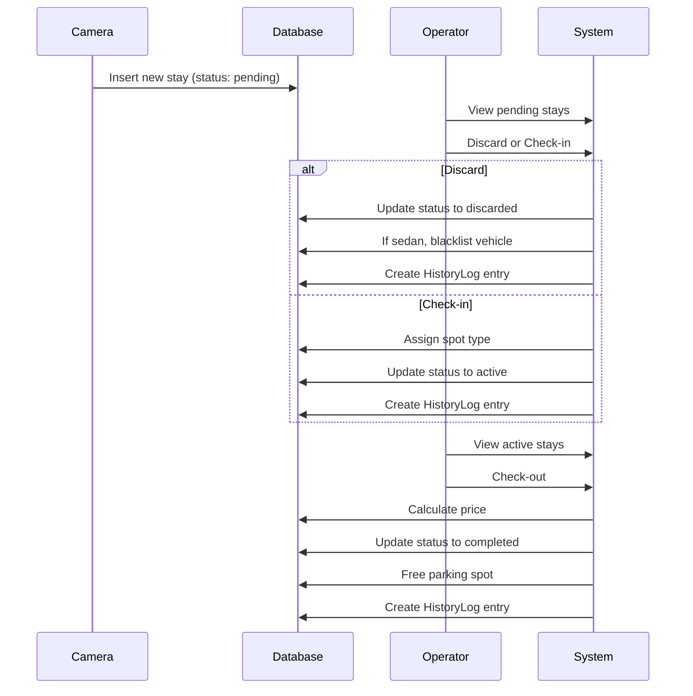

# Caravan Parking Management App - Project Structure

## Directory Structure

```
dokerized-parking-manager/
├── backend/
│   ├── app/
│   │   ├── __init__.py
│   │   ├── main.py              # FastAPI app setup, CORS middleware
│   │   ├── database.py          # SQLAlchemy connection and session
│   │   ├── models.py            # SQLAlchemy models (User, Vehicle, ParkingSpot, Stay, HistoryLog)
│   │   ├── schemas.py           # Pydantic schemas for validation
│   │   ├── crud.py              # Business logic functions
│   │   ├── dependencies.py     # JWT authentication dependency
│   │   └── api/
│   │       ├── __init__.py
│   │       ├── auth.py          # /token endpoint for login
│   │       ├── stays.py         # Endpoints for managing stays
│   │       ├── dashboard.py     # /dashboard/data endpoint
│   │       └── history.py       # /history endpoint
│   ├── requirements.txt         # Python dependencies
│   └── Dockerfile               # Backend Docker image
├── frontend/
│   ├── public/
│   ├── src/
│   │   ├── components/
│   │   │   ├── Header.js       # Navigation header
│   │   │   └── Footer.js       # Page footer
│   │   ├── pages/
│   │   │   ├── Login.js         # Authentication form
│   │   │   ├── Dashboard.js     # Main dashboard with pending/active cards
│   │   │   └── History.js       # History log table
│   │   ├── services/
│   │   │   └── api.js           # Axios configuration with JWT interceptor
│   │   ├── App.js               # Main React component
│   │   └── index.js             # React entry point
│   ├── package.json             # Node.js dependencies
│   └── Dockerfile               # Frontend Docker image
├── docker-compose.yml           # Docker Compose configuration
└── README.md                    # Build and run instructions
```

## System Architecture

### Backend (FastAPI)
- **Authentication**: JWT-based authentication for all API endpoints except /token
- **Database**: PostgreSQL with SQLAlchemy ORM
- **Models**:
  - User: Operator authentication
  - Vehicle: Vehicle information with blacklist functionality
  - ParkingSpot: Physical parking spots (66 total with types A, B, C, Special)
  - Stay: Core business logic with status tracking
  - HistoryLog: Audit trail for all actions

### Frontend (React)
- **Routing**: React Router for navigation
- **API Communication**: Axios with JWT interceptor
- **Key Pages**:
  - Login: Authentication form
  - Dashboard: Main interface with pending and active stays
  - History: Action log table

### Docker Configuration
- **Services**: PostgreSQL, FastAPI backend, React frontend (Nginx)
- **Data Persistence**: PostgreSQL volume for data persistence
- **Networking**: Inter-service communication through Docker network

## Workflow Diagram



## Database Schema

```mermaid
erDiagram
    User ||--o{ Stay : "manages"
    User ||--o{ HistoryLog : "performs"
    Vehicle ||--o{ Stay : "has"
    ParkingSpot ||--o{ Stay : "assigned to"
    Stay ||--o{ HistoryLog : "logged in"
    
    User {
        int id PK
        string username UK
        string hashed_password
        boolean is_active
    }
    
    Vehicle {
        int id PK
        string license_plate UK
        string vehicle_type
        string brand nullable
        string country nullable
        boolean is_blacklisted
    }
    
    ParkingSpot {
        int id PK
        string spot_number UK
        enum spot_type
        boolean is_occupied
    }
    
    Stay {
        int id PK
        int vehicle_id FK
        int parking_spot_id FK nullable
        datetime detection_time
        datetime check_in_time nullable
        datetime check_out_time nullable
        enum status
        float final_price nullable
        int user_id FK nullable
    }
    
    HistoryLog {
        int id PK
        int stay_id FK
        string action
        datetime timestamp
        json details nullable
        int user_id FK
    }