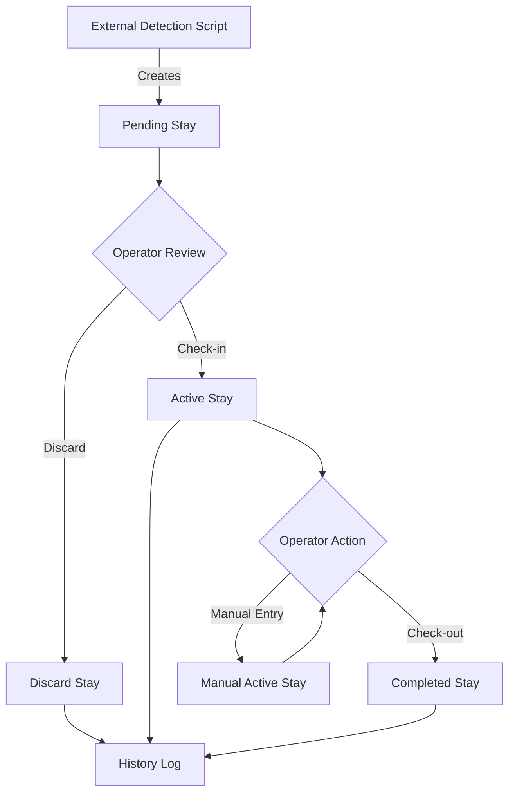
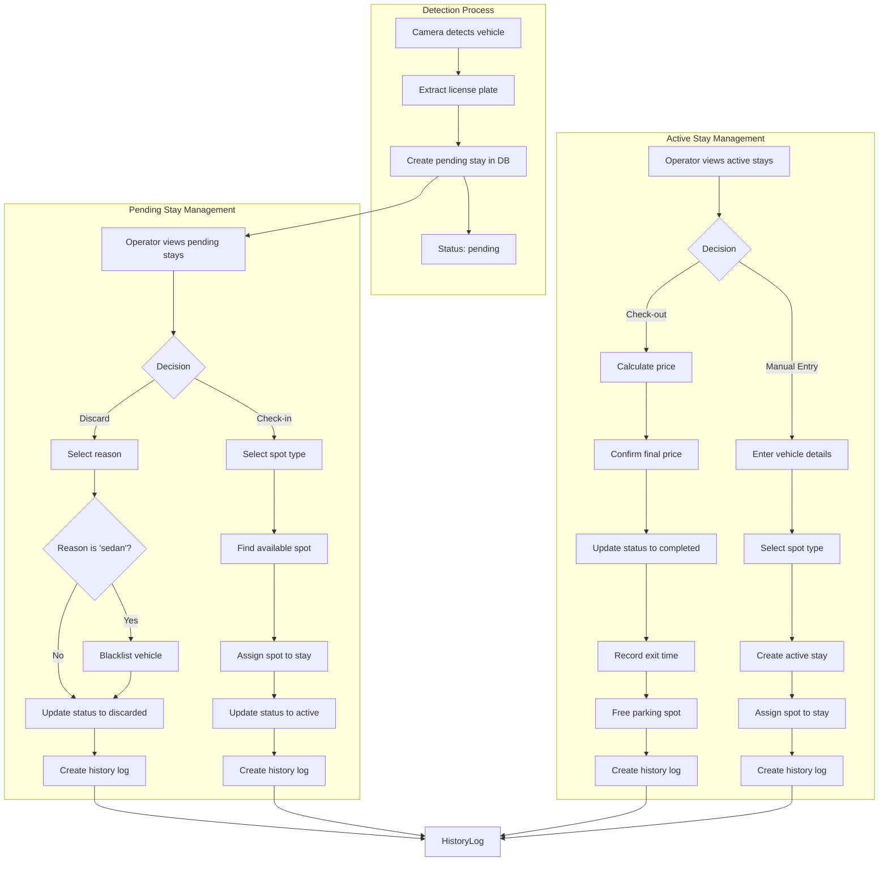
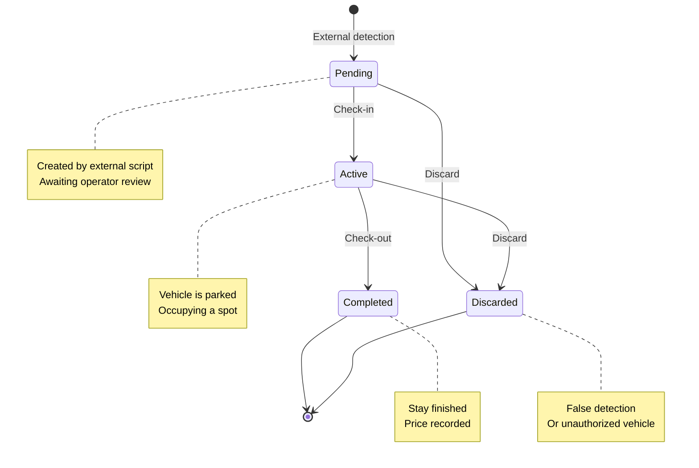
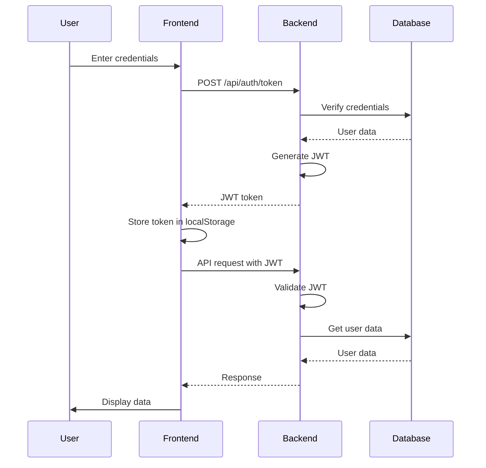
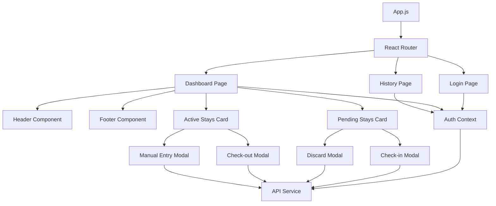
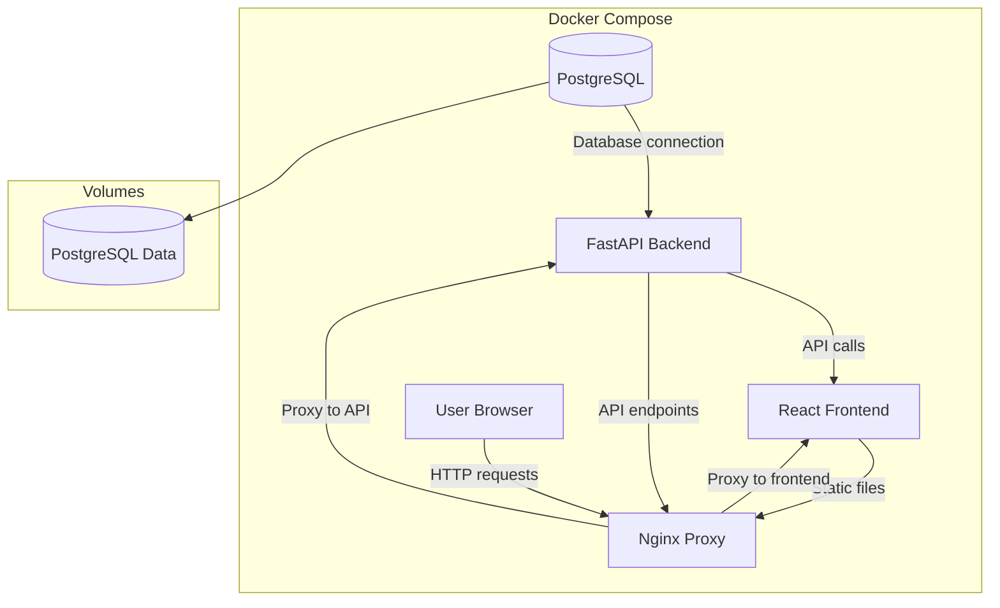

# Caravan Parking Management System - Workflow Diagram

## System Workflow Overview



## Detailed Stay Management Workflow



## Database Schema Relationships

```mermaid
erDiagram
    User ||--o{ Stay : "manages"
    User ||--o{ HistoryLog : "performs"
    Vehicle ||--o{ Stay : "has"
    ParkingSpot ||--o{ Stay : "assigned to"
    Stay ||--o{ HistoryLog : "logged in"
    
    User {
        int id PK
        string username UK
        string hashed_password
        boolean is_active
    }
    
    Vehicle {
        int id PK
        string license_plate UK
        string vehicle_type
        string brand nullable
        string country nullable
        boolean is_blacklisted
    }
    
    ParkingSpot {
        int id PK
        string spot_number UK
        enum spot_type
        boolean is_occupied
    }
    
    Stay {
        int id PK
        int vehicle_id FK
        int parking_spot_id FK nullable
        datetime detection_time
        datetime check_in_time nullable
        datetime check_out_time nullable
        enum status
        float final_price nullable
        int user_id FK nullable
    }
    
    HistoryLog {
        int id PK
        int stay_id FK
        string action
        datetime timestamp
        json details nullable
        int user_id FK
    }
```

## Stay Status Transitions



## Authentication and Authorization Flow



## Frontend Component Structure



## Docker Architecture



## API Endpoint Structure

```mermaid
graph LR
    subgraph Authentication
        A1[POST /api/auth/token]
        A2[GET /api/auth/users/me]
    end
    
    subgraph Stays Management
        B1[GET /api/stays/pending]
        B2[GET /api/stays/active]
        B3[POST /api/stays/{id}/check-in]
        B4[POST /api/stays/{id}/check-out]
        B5[POST /api/stays/{id}/discard]
        B6[POST /api/stays/manual]
    end
    
    subgraph Dashboard
        C1[GET /api/dashboard/data]
    end
    
    subgraph History
        D1[GET /api/history]
    end
    
    A1 -->|JWT Token| B1
    A1 -->|JWT Token| B2
    A1 -->|JWT Token| B3
    A1 -->|JWT Token| B4
    A1 -->|JWT Token| B5
    A1 -->|JWT Token| B6
    A1 -->|JWT Token| C1
    A1 -->|JWT Token| D1